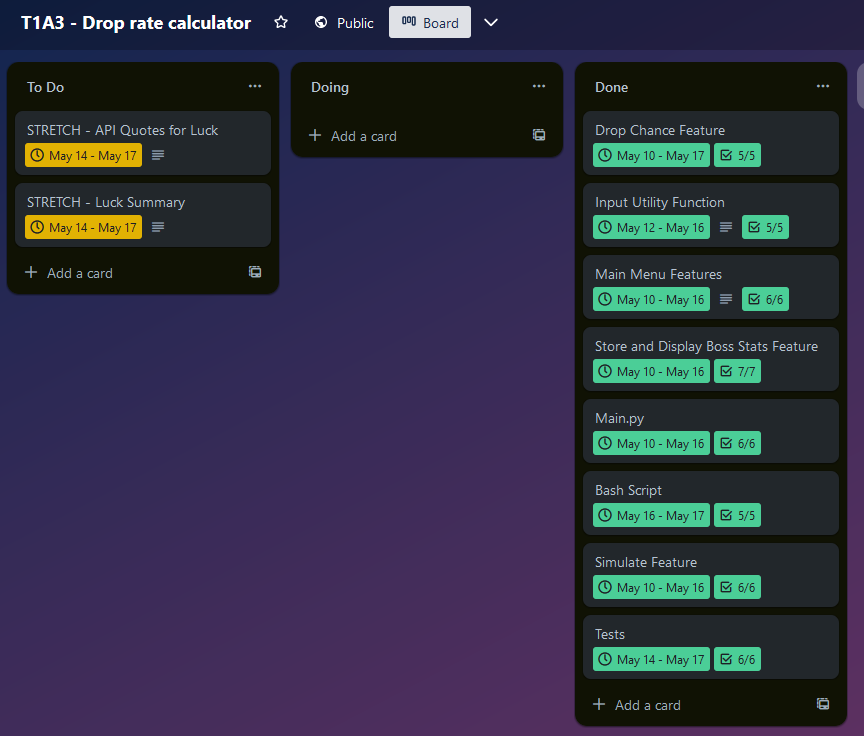

# T1A3 - Terminal Application
# **Drop Chance Calculator**
## Important Links 

* [GitHub Repo](https://github.com/CameronWD/T1A3)
* [Trello Board](https://trello.com/b/3npKVqHD/t1a3-drop-rate-calculator)
* [Presentation](https://youtu.be/WJEf7qiIxBw)
* [Slide Deck](ppt/T1A3%20--%20Drop%20Calculator.pdf)
* [Style Guide Used](https://peps.python.org/pep-0008/)
* [Help File](#installation-and-running-the-program)

## Introduction 

Welcome to my Python program, *Drop Chance Calculator*.

Designed to provide a simple and easy-to-use utility for gamers who frequently engage in boss fights where luck is an aspect of getting rewards. If you are someone who has wondered how lucky or unlucky you are currently, this program may provide you with some insight.

Before diving into the functionality of the program, it is important to clarify some terminologies and concepts that are frequent within the world of video games.

**Kill count:** This refers to the number of times a player has defeated a specific boss. This number is important to track as its relation to the odds of receiving certain items helps users gain insight into how lucky they are.

**Drop:** A drop is a broad term used for items that are received from a boss. Similar words like loot or rewards could also be used.

**Drop rate:** This is the probability of a boss dropping a specific item when defeated. While many games have many differing mechanics surrounding this, certain assumptions have been made for drop rate calculations in this program. It is assumed that the drop rate has no memory or 'bad luck' mechanic. Every kill attempt results in the same chance of receiving the drop. The fancier term being a series of Bernoulli trials. Often these rates can be given as a percentage or out of 1/droprate, e.g., 5%, 0.05, or 1/20. Most games have a way to know what the drop rate of an item is, which is really helpful for our purpose!

What draws many gamers to video games is the aspect of chance, and earning drops from particular bosses gives an element of earning rewards which can be a satisfying, albeit frustrating at times, gameplay loop. By comparing your kill count in relation to the drop rate and the number of items you have received, players are able to learn more about how lucky or unlucky they are. This program allows users to see what percentile of probability they are in relation to their kill count and the drop rate of a specific item. It allows users to simulate receiving X amount of drops from a boss, displaying the average rate the program received drops in addition to the luckiest and unluckiest streaks. Finally, users can store their kill count, boss names, drop rate, and successful occurrences too.

This program is designed to be simple to use and a little bit of fun.

Best of luck!

## System Requirements 

- OS: Any that can run Python (more niche OS's may have issues with certain packages running correctly, but this should not affect functionality).
- Python 3

## Dependencies 

This application requires the following Python packages:

- prettytable==3.7.0
- termcolor==2.3.0
- tqdm==4.65.0
- wcwidth==0.2.6
- art==5.9
- setuptools==59.6.0

## Installation and Running the Program

- [Mac or Linux](docs/helpMacLinux.md)
- [Windows](docs/helpWindows.md)

## How to use 

After starting the application, you are greeted with the main menu screen. Enter the number that corresponds to the feature you would like to use:

1. **Calculate Drop Chance:** This option asks you to enter the boss name, the drop rate, and the number of attempts you've made. You are then shown the drop rate chance per kill and the likelihood of being successful at least once within the number of attempts you have made.
2. **Simulate Drop:** You can enter the name, drop rate, and the number of successful attempts you would like the program to simulate. The output displays a confirmation of the number of successful attempts the program ran, the minimum and maximum number of attempts it took to be successful, and the average drop rate for the simulation.
3. **Store Boss Stats:** You can enter the details for a boss, including name, drop rate, kill attempts, and different items. You can also enter the individual drop rate for different items.
4. **Display Boss Stats:** This function displays the entered boss data in a tabular format. One header table shows the different entered bosses with the kill counts for each one. The second set of tables shows the breakdown per boss, separating individual items within the boss.
5. **Exit option:** Typing 'exit' anywhere in the program will close it.

## Tests 

### Test Case 1: Testing the Drop Rate Calculation
Goal: Test the drop calculator section works correctly

* Test 1.1: Verifies the calculate method of DropCalculator correctly attributes the input values to the correct variables. It is important that these variables are understood correctly by the code so that the logic later on is correct.
     Input: Boss name, 100, and 100
     Expected output: boss_name: Boss name, drop_rate = 0.01, and attempts = 100

* Test 1.2: Tests that the success_probability part of the code calculates the correct answer.
     Input: Boss name, 100, and 100
     Expected output: success_probability = 0.6339676587267709

### Test Case 3: Main Menu
Goal: The centerpiece of the program. Imperative that the operations within this part of the code work as expected.

* Test 2.1: Checks that the boss_stats.json is present in the folder and that if it is not, it will be created. It's important to check this file is there as the display feature aims to access this file. This process will then create a new one if none is found.
     Input: Simulates that boss_stats.json has not been found using side_effect FileNotFoundError()
     Output: "boss_stats.json not found. Creating a new file now." - tests that cprint functions correctly

* Test 2.2: This test ensures that the main menu options are called correctly. Simulating user input and then checking the correct method is output
     Input: Selecting option 1 by entering one
     Output: Display method is to return one that would open the drop calculator

## Development Plan Managemnet 

My strategy for my planning was to use a Trello board. I iniitally made a large list of what I wanted to accomplish on the "to do" section. I would move a section to the "doing" section where I would then flesh out what I would be doing. Creating a checklist of tasks I would need to do to complete that particular item. Finally I would move those items into "done" once I had completed the items within the checklist. I had two stretch features I wanted to possibly add if I had lots of time but that did not happen. They are still in the to do section but I was okay not attempting them as it was more important to do what I had correctly first. 

